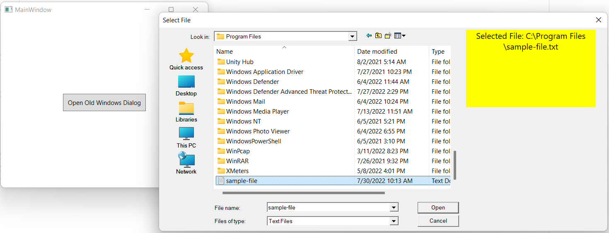

### Features
- Preview the file once the user select it.
- Callbacks on dialog closing: `OnDialogClose`, `OnFileChosen`.
- Preview-Area Positioning (Right, Bottom/[Todo](/../../issues/1)).
- Traditional functions: file filters, dialog title, multi-selection, etc..



### How to Use

**General Steps:**
1. Create preview.xaml 
2. Open the dialog form C#

**Detailed Steps:**

See [Sample Application](./LegacyWinExplorerWithPreviewPanel.Sample)

1. Add `LegacyWinExplorerWithPreviewPanel` project as a new reference to your WPF application.
2. Create the preview area .xaml file.. the base class is of type `ControlAddOnBase`, for
   example (`MyPreviewArea.xaml`):

```xaml
<wpfCustomFileDialog:ControlAddOnBase
    x:Class="LegacyWinExplorerWithPreviewPanel.Sample.Views.MyPreviewArea"
    xmlns="http://schemas.microsoft.com/winfx/2006/xaml/presentation"
    xmlns:x="http://schemas.microsoft.com/winfx/2006/xaml"
    xmlns:wpfCustomFileDialog="clr-namespace:WpfCustomFileDialog;assembly=WpfCustomFileDialog"
    Width="350" Height="500"
    Loaded="Control_Loaded"
    Background="#F0F0F0">

    <Grid VerticalAlignment="Top"
          MaxWidth="250"
          Height="150"
          Margin="-25,4,75,0">
        <TextBlock
            x:Name="FileText"
            Background="Yellow"
            TextAlignment="Center"
            FontSize="16"
            TextWrapping="Wrap"
            VerticalAlignment="Stretch"
            HorizontalAlignment="Stretch" />
    </Grid>
</wpfCustomFileDialog:ControlAddOnBase>
```

3. Interaction with new file selection will be in `MyPreviewArea.xaml.cs`, for example:

```csharp
public partial class MyPreviewArea : ControlAddOnBase
 {
     public MyPreviewArea()
     {
         InitializeComponent();
     }

     private void Control_Loaded(object sender, RoutedEventArgs e)
     {
         ParentDlg.EventFileNameChanged += (_, path) =>
             FileText.Text = $"Selected File: {path}";
     }
 }
```

4. Opening the dialog

```csharp
LegacyOpenFileDialogHelper.OpenCustomFileDialog<MyPreviewArea>(
     onFileChosen: s => MessageBox.Show(s + " File Chosen"),
     onDialogClose: () => Debug.WriteLine("Custom Dialog Closed")
 );
```

---

### Credit.

Codebase from [dmihailescu](https://github.com/dmihailescu/CustomFileDialog/tree/master/CSharp_Code)